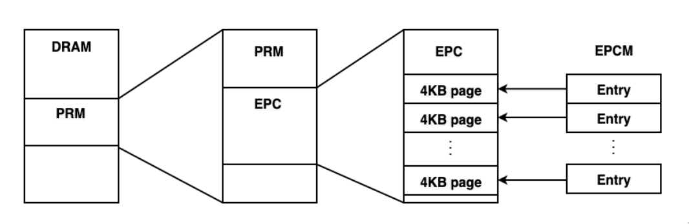
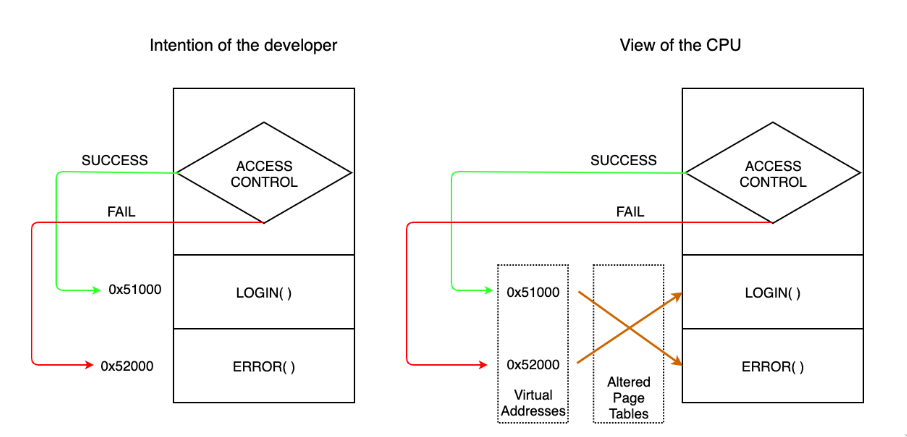
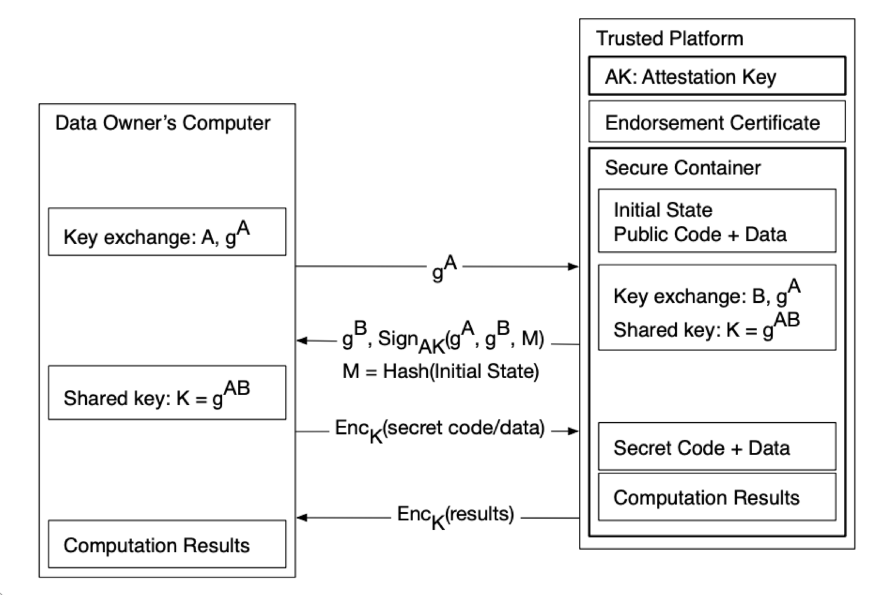
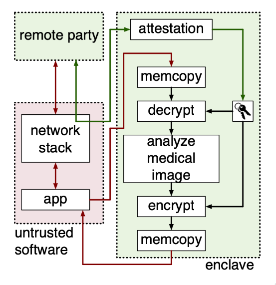

In this blog post, I want to introduce the concept of **Trusted Execution Environments (TEE)** with Intel SGX. A TEE is a secure area within the main processor that protects confidentiality and integrity of code and data loaded into it. That means adversaries can't gain access to nor modify sensitive data. They also can't replace or modify the code that runs on that sensitive data. Since the security mechanisms are hardware-based, even privileged attackers that have taken control over the operating system cannot compromise the TEE. 

**Intel Software Guard Extensions (Intel SGX)** is an Intel architecture extension that comes with a set of new CPU instructions and memory access changes to add support for TEEs within Intel processors. The underlying concepts were introduced [in white papers by Intel](https://www.intel.com/content/www/us/en/developer/articles/technical/innovative-technology-for-cpu-based-attestation-and-sealing.html) in 2013 and became available from the 6th generation of processors onwards. SGX was designed to solve the problem of secure remote computation, i.e., executing software on an untrusted remote computer with some confidentiality and integrity guarantees.

One can say that there exist three core concepts behind Intel SGX that one needs to understand. These are **enclaves, attestation and sealing**. Furthermore, we will have a short look at applications, possible attacks and sample code.

# Isolation via Secure Enclaves

Applications written for Intel SGX are generally split into two parts, an untrusted part and a trusted part called enclave, which is a protected environment for all security-critical operations and data. The confidentiality and integrity of the data and computation performed inside an enclave is shielded from attacks coming from malicious software on the same computer, even from the system software. Execution flow can only enter the enclave via special CPU instructions. SGX does this by setting aside a portion of memory inside the **Processor Reserved Memory (PRM)** and protecting it from all non-enclave memory accesses, including the OS and hypervisor. The associated memory is encrypted and only gets decrypted when inside the CPU.

Fig.1 - Intel SGX Memory Layout

Each enclave gets assigned **Enclave Page Cache (EPC)** pages and the CPU tracks additional security-related information about each EPC page within the Enclave Page Cache Metadata (EPCM), all inside the PRM. This needs to be done, because the system software is responsible for the allocation of EPC pages. However, the system software itself is untrusted, therefore SGX processors need a way to check, if the system software correctly handles the page allocation. 

For example, it needs to store the identifier for a specific enclave inside the EPCM entry for the associated EPC page, to ensure that an EPC page cannot be mapped to more than one enclave, ast this way of sharing memory between enclaves would enable leakage of information to a potentially malicious enclave. 

Also, access rights (Read,Write or Execute) of an EPC page are stored in its corresponding EPCM entry,so that the processor can detect, when the system software has tampered with the access rights. Another piece of information that is stored inside theEPCM for security reasons is the virtual address of the EPC page. This is to counter Address Translation Attacks. 

Imagine a scenario, where we have code that performs access control (see Figure 2). When the access control passes, e.g. when the right token was provided, we execute some portion of code that resembles a LOGIN() function and is located within the page with the virtual address of 0x51000. Else, an error is displayed using the ERROR() code at virtual address 0x52000, where no access is granted. But as one can see in the right half of Figure 2, the system software can modify the page table at will and therefore is able to change the mapping between virtual and physical address, switching the pointers to the LOGIN() and ERROR() page. That means, when the access control fails, the attacker still gets logged in. But with Intel SGX, the intended virtual address of an EPCpage is stored in its EPCM entry, so the CPU can check, if the virtual address from which a request was mapped to the physical address of the EPC page, is actually the correct virtual address or if the mapping inside the page table was manipulated. A wider range of attacks are discussed in a later section about side-channel attacks on Intel SGX. 

Fig.2 - A simple Address Translation Attack

An important question arises that when non-enclave software cannot directly access the PRM, which is very important for the isolation guarantees of enclaves, how can system software load the initial code and data into a newly created enclave? The initial code is indeed loaded in by untrusted system software. During the initialization, the system software asks the CPU to copy the data from untrusted memory into EPC pages and assigns those pages to the specific enclave. When this process is finished, the enclave is marked as initialized. Now, software can execute inside that enclave, but the system software can no longer add new EPC pages, so the enclave becomes tamper-proof and truly isolated. As the finalization of the initial loading step, a measurement of the enclave is computed, which is the hash over the enclave’s code and its initial data, taking into account the order of the placement of the pages and their security properties. This functions as the identity of the enclave, since any change in the code or data results in an entirely different measurement. This fact will enable a remote party to perform software attestation.

# Establishing Trust via Remote Attestation

Using remote attestation, a user that is communicating with an enclave can ensure that it was setup properly within a secure container hosted by trusted hardware and that the code executing inside that enclave is unmodified and as intended by the user. Any unauthorized changes to the software on the remote computer can be immediately recognized. This works by letting the trusted hardware generate a certificate that proves that the software was unaltered via signing its measurement introduced in the previous section. After the user has performed remote attestation and therefore has established trust in the correct workings of the enclave, she can proceed to provision her secrets to the enclave. The proposed remote attestation schemes slightly differ between various architectures, e.g. for **Intel SGX**, **RISC-V** or **ARM**. Here, we will only introduce a simple generic version that combines remote attestation with a key agreement protocol to highlight the general principle.

Fig.3 - Remote Attestation combined with DKE

In Figure 3, we see a **Diffie-Hellman Key Exchange (DKE)** to compute a shared key and establish a secure channel between the user and the trusted platform for secret provisioning. The only modification to the standard DKE is that the response of the trusted platform also contains the signed measurement hash M. More specifically, when the remote party receives $g^A$ from the user, it generates $g^B$ in software and asks the trusted hardware to sign $(g^A, g^B, M)$. After the user has verified the signature, it serves as authentication of the trusted platform, which prevents Man-in-the-middle attacks that stem from lack of authentication in key exchange protocols. If the verified measurement of the trusted platform does not match the user’s expectations, she denies further communication and does not provision her secrets to the enclave. The chain of trust is rooted at a signing key by the hardware manufacturer, acting as a **Certificate Authority (CA)**. The hardware manufacturer has stored a unique attestation key inside the hardware in tamper-proof storage during manufacturing, which is used to produce the signatures. The manufacturer also has generated an endorsement certificate, which can be used to validate the associated attestation key. Note that this design requires that the user has to trust the hardware manufacturer.

# Securing Data via Sealing

Sealing refers to securely storing data outside of the enclave, ”sealed” from access/home/henry/Desktop/blog/themes/ezhil/layouts/404.html by anyone but the enclave itself. Sealed storage is an important concept, because we need a way to persist data securely outside of the enclave. On the one hand, this is due to the limited memory of 128 MB set aside for EPC pages inside the PRM. In consequence, we can run out of space, and Intel SGX needs a secure way to evict pages to DRAM and load them back later on. On the other hand, all secrets provisioned to an enclave get lost when the enclave is destroyed. Here, we need sealed storage as well in order to maintain this secret data across sessions. For storing data in unprotected storage, three things are taken care of by Intel SGX’s sealing mechanism: Confidentiality via encryption, integrity via MACs and freshness via nonces. The derivation of the sealing key used for those cryptographic primitives is possible with two different policies: We can bind the key to the current enclave’s identity or to the enclave author. While the former only allows the restoration of the sealed secrets by the exact same enclave, the later enables sharing information via sealed storage between different enclaves of the same author.

# Applications

Intel SGX is used in cases where sensitive data should be processed privately on a remote computer and/or when a remote computation should be executed securely without the underlying system to be able to intervene with its integrity.

Fig.4 - Example for an SGX Application

A concrete example is shown in Figure 4: A cloud service performs some form of image processing with confidential medical images. To protect data privacy, the user encrypts the input images and provisions the decryption keys securely inside the enclave, after having performed remote attestation. The enclave contains the code for encrypting and decrypting the images and the image processing algorithm. Code for receiving sent images and storing them should be implemented outside the enclave, as it is not relevant for security and privacy. Subsequently, the enclave can sendback encrypted results to the user. Real world use cases include privacy-preserving machine learning and data analytics. More widely known software that makes use of Intel SGX are Signal for private contact discovery or in the Hyperledger Sawtooth Blockchain framework for its scalable and efficient Proof of ElapsedTime (PoET) consensus algorithm. 

# Side-Channel Attacks

Unfortunately, Intel SGX is vulnerable to a range of well-known side-channel attacks, that can deplete the confidentiality guarantees of the data to varying extend. It is in the hand of the developer to build counter measurements against those type of attacks into the code. In the following section, some basic classes of side-channel attacks that also apply to Intel SGX are outlined. For a more thorough discussion of the topic refer to this [survey](https://arxiv.org/pdf/2006.13598.pdf).

**Controlled-Channel Attacks** make use of the fact that the untrusted OS has full control over theplatform, e.g., memory management and can modify page tables at will. One way of exploiting this is to induce artificial page faults by setting the ”present” bit in page table entries to 0 in order to leak information about which page was accessed by the enclave. [Subsequent research](https://dl.acm.org/doi/10.1145/2897845.2897885) showed that even bits of cryptographic keys can be extracted in this way.

Cache Attacks exploit the cache-hierarchy system, where portions of the code that were accessed more recently are higher in the cache-hierarchy for lower latency. The time difference between a memory access causing a cache miss compared to a cache hit can be easily tracked, allowing an attacker to infer, which cache lines got accessed. One common methodology for this is the PRIME+PROBE approach. In the priming phase, the attacker fills up the cache with arbitrary data. In theprobing phase, the attacker then runs the algorithm and afterwards measures the access times for the data written in the priming phase, from which he can infer if a cache hit or miss occurred. This knowledge is enough to even [extract AES keys](https://arxiv.org/abs/1703.06986).

Speculative Execution Attacks are based on an optimization technique of modern processors, where processors speculatively execute instructions. When a branch occurs, they make a prediction about which branch is likely to be chosen and then follow that branch. Of course, the CPU will rollback the instructions once it becomes clear that the wrong branch was taken, but this still leaves intermediate traces in the caches, which can be exploited. This is the underlying concept of the [Spectre](https://spectreattack.com/spectre.pdf) security vulnerability discovered in 2017. Researchers have shown that speculative execution attacks are also [applicable to Intel SGX enclaves](https://arxiv.org/abs/1802.09085).

# Code Example

Finally, for a simple code example, check out this [repository](https://github.com/shangsuru/sign-enclave). It can be run even on processors that do not support Intel SGX, using simulation mode inside a Docker container. In this application, the enclave signs and verifies messages sent by clients using ECDSA from SGXs cryptographic API. The enclave code is inside the enclave folder, together with a configuration file (Enclave.config.xml) and the enclave.edl file, which defines the interface of the enclave (ECALLs and OCALLs). 

# Resources

[An in-depth explanation of Intel SGX](https://www.nowpublishers.com/article/Details/EDA-051) can be found in "Secure Processors" by Costan et al. Pictures of this article also come from this paper.

[Intel's developer reference](https://01.org/sites/default/files/documentation/intel_sgx_sdk_developer_reference_for_linux_os_pdf.pdf) will come in handy, when you want to start build applications with Intel SGX.

[Further code samples](https://github.com/intel/linux-sgx/tree/master/SampleCode) can be found on the Intel SGX Github repository.