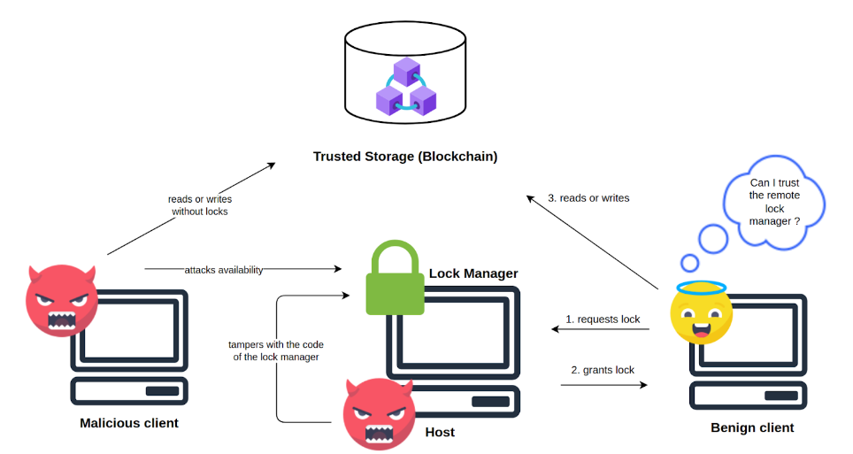
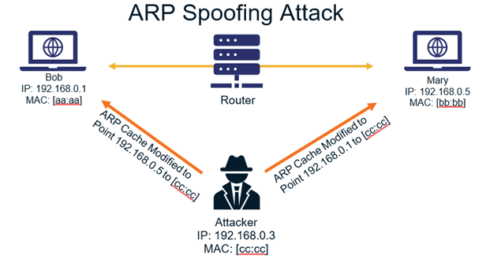
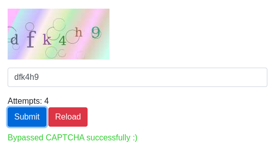
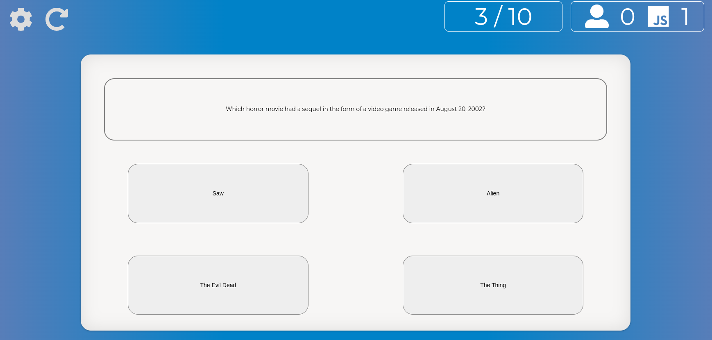
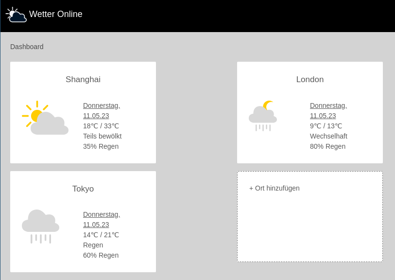
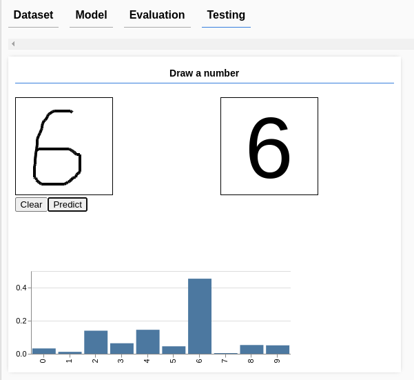
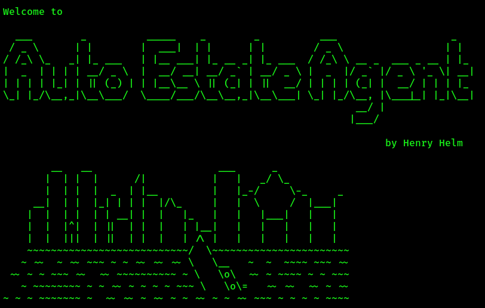
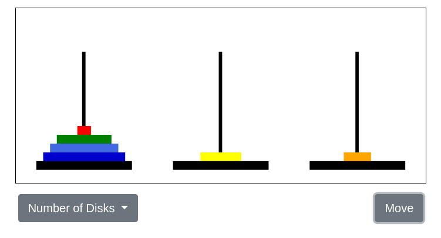
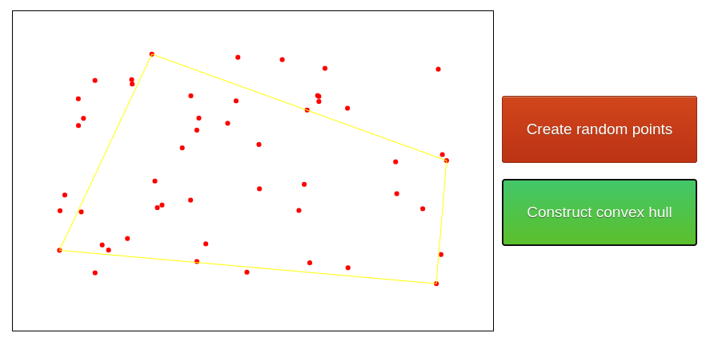

- 2023: [Multiplayer Go Game](projects#multiplayer-go-game-2023)
- 2022: [Verifiable Lock Manager](projects#verifiable-lock-manager-2022), [Sign Enclave](projects#sign-enclave-2022), [Keylogger](projects#keylogger-2022), [ARP Spoofer](projects#arp-spoofer-2022)
- 2021: [CAPTCHA Breaker](projects#captcha-breaker-2021), [NAS scheduler](projects#nas-scheduler-2021)
- 2020: [Quiz against JS](projects#quiz-against-js-2020), [Weather App](projects#weather-app-2020), [Digits Classifier](projects#digits-classifier-2020), [Auto Estate Agent](projects#auto-estate-agent-2020)
- 2019: [Traveling Salesman](projects#traveling-salesman-2019), [Tic-Tac-Toe AI](projects#tic-tac-toe-ai-2019), [Sudoku Solver](projects#sudoku-solver-2019), [Tower of Hanoi](projects#tower-of-hanoi-2019), [Convex Hull Algorithm](projects#convex-hull-algorithm-2019)

# Multiplayer Go Game (2023)

**Technologies**: AWS CDK, React, Amplify UI

**Description**: The game of Go is a two-player abstract strategy board game in which players aim to surround more territory than their opponent. Players can host games of different board size and duration and play against each other to increase their rating!

# Verifiable Lock Manager (2022)

**Technologies**: C++, Intel SGX, CMake

**Description**: My bachelor thesis, a centralized lock manager component inside a Trusted Execution Environment to enforce a locking-based concurrency control scheme that is Byzantine fault-tolerant. It is envisioned to be used within [TrustDBle](https://scfab.github.io/2020/FAB2020_p7.pdf), a DBMS based on Blockchain that can be used for shared access by multiple parties.

# Sign Enclave (2022)

**Technologies**: C++, Intel SGX, CMake

**Description**: Intel SGX is a hardware-based security technology that allows applications to create secure enclaves to protect sensitive data from being accessed by unauthorized processes. This project demonstrates several fundamental usages of the Intel SGX SDK: Initializing and destroying an enclave, creating ECALLs or OCALLs and using ECDSA from SGXs cryptographic API to sign and verify messages sent to the enclave.

# Keylogger (2022)

**Technologies**: Go, Kernel Programming, RabbitMQ, Docker Compose

**Description**: A malicious kernel module written in C collects the keystrokes typed in by the user and sends it to a server. A master node receives the keystrokes and inserts them into a message queue, from which worker nodes can insert it into the database.

# ARP Spoofer (2022)

**Technologies**: Go

**Description**: This small Go program is a command line utility to demonstrate ARP spoofing. ARP is a protocol that is used to map IP addresses to MAC addresses. In an ARP spoofing attack, the attacker sends fake ARP messages with the aim of associating their own MAC address with the IP address of another device on the network. An attacker can use it to perform a man-in-the-middle attack, intercepting network traffic between two devices and viewing or modifying the data being transmitted.

# CAPTCHA Breaker (2021)

**Technologies**: OpenCV

**Description**: This solves the CAPTCHAS from the library https://www.npmjs.com/package/nodejs-captcha automatically with a CNN!

# NAS scheduler (2021)

**Technologies**: Python, K8s, redis

**Description**: The NAS Scheduler project aims to combine the advancements of deep learning and cloud computing to accelerate the training process and manage the training of several models at a time, using Docker and Kubernetes to streamline resource scaling. The final architecture consists of a scheduler, progressor, worker cluster, and command-line client.

# Quiz against JS (2020)

**Technologies**: Spring Boot, React, MySQL

**Description**: A quiz-app, where you can add your own questions and play against a simple question answering system that googles the question and chooses the answer with most apearances within the search results.

# Weather App (2020)

**Technologies**: Node.js, React, Postgres

**Description**: This web application is designed to retrieve weather forecast data (both daily and hourly) for selected cities from the openweathermap API.

# Digits Classifier (2020)

**Technologies**: Javascript, Tensorflow.js

**Description**: This program trains a Convolutional Neural Network (CNN) on the MNIST dataset to be able to classify handwritten digits from 0 to 9. Metrics like loss and accuracy are modeled live during the training phase. Then, a confusion matrix is shown that explains how well the model performs on the different digits. Finally, the user can draw their own number on the screen and view the model's prediction.

# Auto Estate Agent (2020)

**Technologies**: Python, Selenium

**Description**: This project involves web scraping using selenium, enabling the user to fully automate their search for a flat on the German flat search site immobilienscout24 via a CLI interface. By inputting specific details such as maximum rent and minimum living space, the program continuously monitors the listings and automatically sends a pre-defined message to landlords if their offering meets the search criteria. However, the program is no longer functional with the latest version of immobilienscout24.

# Traveling Salesman (2019)

**Technologies**: Javascript, HTML, CSS

**Description**: The Traveling Salesman Problem can be stated as follows: Given a list of cities and the distances between each pair of cities, find the shortest possible route that visits each city exactly once and returns to the starting city. It is a classic example of a combinatorial optimization problem that is known to be NP-hard.

# Tic-Tac-Toe AI (2019)

**Technologies**: Javascript, HTML, CSS

**Description**: You can play Tic-Tac-Toe with against an unbeatable AI! The AI is implemented using the Minimax algorithm. It works by recursively evaluating all possible moves and choosing the move that maximizes the player's chances of winning, while minimizing the opponent's chances of winning.

# Sudoku Solver (2019)

**Technologies**: Javascript, HTML, CSS

**Description**: Sudoku is a logic-based puzzle that involves filling a 9x9 grid with digits from 1 to 9, such that each row, column, and 3x3 subgrid contains all the digits exactly once. It can be solved programatically using an algorithmic technique called backtracking.

# Tower of Hanoi (2019)

**Technologies**: Javascript, HTML, CSS

**Description**: The Tower of Hanoi is a classic programming puzzle that involves moving a stack of disks of different sizes from one peg to another, while no disk may be placed on top of a smaller disk. It is solved using recursion.

# Convex Hull Algorithm (2019)

**Technologies**: Javascript, HTML, CSS

**Description**: This is an implementation and visualization of the Convex Hull Algorithm. The convex hull of a set of points is defined as the smallest convex polygon that contains all the points in the set. It has applications in collision detection and computer graphics.

